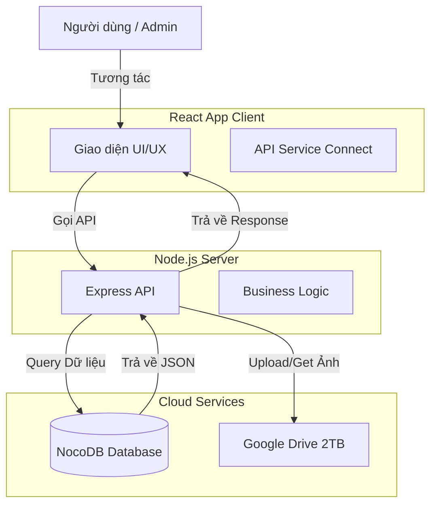

# Kế hoạch Triển khai Backend NocoDB & Lưu trữ Ảnh

## 1. Phân tích Tổng quan
Hiện tại, hệ thống của bạn đang chạy:
- **Frontend**: React (Vite)
- **Backend**: Node.js + Express
- **Database**: SQLite (Local)
- **Storage**: Local File System (`/uploads`)

**Mục tiêu**: Chuyển đổi sang sử dụng **NocoDB** làm cơ sở dữ liệu và quản lý lưu trữ online, giúp dễ dàng quản lý dữ liệu qua giao diện spreadsheet và triển khai lên môi trường internet (không phụ thuộc file local).

---

## 2. Giải pháp Lưu trữ Ảnh (Image Storage)
Bạn cần một thư viện/dịch vụ lưu trữ ảnh vì NocoDB tuy có thể lưu file (Attachment) nhưng việc `serving` ảnh ra public app với tốc độ cao và tối ưu dung lượng thì không chuyên biệt bằng các dịch vụ chuyên dụng.

### Giải pháp: Google Drive (Tận dụng tài khoản 2TB)
- **Lý do**:
    - Tận dụng dung lượng lớn 2TB có sẵn.
    - Tiết kiệm chi phí thêm dịch vụ ngoài.
- **Lưu ý**: Google Drive không phải là CDN chuyên dụng nên tốc độ tải ảnh lần đầu có thể chậm hơn Cloudinary/GCS một chút, nhưng chấp nhận được.
- **Thư viện**: `googleapis`.

=> **Chốt**: Dùng **Google Drive API** để upload và lấy link ảnh.

---

## 3. Sơ đồ Kiến trúc (Architecture Diagram)

---

## 4. Kế hoạch Triển khai (Implementation Plan)

### Giai đoạn 1: Thiết kế Cơ sở dữ liệu trên NocoDB
Cần tạo các bảng (Tables) tương ứng trên NocoDB dựa trên cấu trúc SQLite hiện tại:

1.  **Table: Categories**
    - `id` (Primary Key, Text)
    - `name` (Text)
    - `icon` (Text/Attachment)
    - `created_at` (DateTime)

2.  **Table: Templates**
    - `id` (Primary Key, Text)
    - `title` (Text)
    - `description` (Long Text)
    - `category_id` (Link to Categories)
    - `image_path` (URL Text - link Google Drive View)
    - `text_slots` (JSON)
    - `image_slots` (JSON)
    - `color_slots` (JSON)
    - `style_prompt` (Text)

3.  **Table: Designs** (Lưu kết quả người dùng tạo)
    - `id` (Primary Key, Text)
    - `template_id` (Link to Templates)
    - `image_path` (URL Text - link Google Drive View)
    - `form_data` (JSON)

### Giai đoạn 2: Backend Development (Node.js)
Thay vì rewite toàn bộ Frontend, ta sẽ sửa lớp **Service** ở Backend (Node.js) để nó nói chuyện với NocoDB thay vì SQLite.

1.  Cài đặt thư viện: `npm install nocodb-sdk googleapis`
2.  Tạo module `services/nocodb.js`: Kết nối API NocoDB.
3.  Tạo module `services/drive.js`: Cấu hình upload ảnh lên Google Drive 2TB.
4.  Refactor `index.js` và `database.js`:
    - Thay thế các hàm local DB bằng NocoDB SDK.
    - Thay thế upload local bằng hàm upload sang Google Drive.

### Giai đoạn 3: UI/UX & Frontend
Về cơ bản Frontend không cần đổi nhiều nếu API Server trả về dữ liệu đúng định dạng cũ.
- **Admin Dashboard**: Có thể dùng trực tiếp giao diện NocoDB để quản lý Templates (thêm sửa xóa Template cực nhanh ngay trên NocoDB không cần code trang Admin riêng). Đây là lợi thế lớn nhất.
- **User Interface**: Giữ nguyên Flow hiện tại (Chọn mẫu -> Chỉnh sửa -> Tải về).

---

## 5. Phân tích Chi tiết UI/UX
Nếu bạn tận dụng NocoDB làm trang Admin (Back-office):

1.  **Luồng Admin (Quản trị viên)**:
    - Truy cập: `db.hpb.edu.vn`.
    - Thêm Template mới: Upload ảnh lên Drive (qua app admin), hệ thống lấy link public, lưu vào NocoDB.
    - Chỉnh sửa thông tin: Sửa trực tiếp như Excel.

2.  **Luồng End-User (Người dùng cuối)**:
    - **Homepage**: Hiển thị danh sách Template fetch từ NocoDB (có phân trang, filter theo Category).
    - **Editor**: Giao diện chỉnh sửa, khi bấm "Save" -> Server nodejs upload ảnh kết quả lên Google Drive -> Lấy link -> Lưu record vào `Designs` trên NocoDB.
    - **My Designs**: Xem lại lịch sử thiết kế (query từ bảng Designs).

## 6. Các bước cần làm ngay
1.  **Setup NocoDB**: Tạo Project và Tables theo cấu trúc trên.
2.  **Chuẩn bị Google Drive**: Tạo Project trên Google Cloud Console, Enable Drive API, Tạo Service Account, Lấy JSON Key.
    *   **Quan trọng**: Tạo 1 Folder trong Drive 2TB của bạn, và Share quyền Editor cho email của Service Account.
3.  **Code Migration**: Viết script chuyển dữ liệu từ SQLite hiện tại sang NocoDB (nếu cần giữ dữ liệu cũ).
4.  **Update Server Code**: Chuyển đổi `runQuery` sang NocoDB SDK SDK call.
