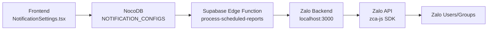

# Zalo Notification Feature - Complete Workflow

Tài liệu chi tiết về tính năng gửi thông báo qua Zalo cá nhân và nhóm.

---

## 1. Tổng quan kiến trúc



---

## 2. Các thành phần chính

### 2.1 Frontend
| File | Chức năng |
|------|-----------|
| `src/pages/NotificationSettings.tsx` | UI cài đặt thông báo, chọn Zalo recipients |
| `src/services/nocodb/notificationService.ts` | API calls đến NocoDB |
| `src/services/zaloAuthService.ts` | Kết nối với Zalo Backend |

### 2.2 NocoDB Tables
| Table | ID | Chức năng |
|-------|-----|-----------|
| `NOTIFICATION_CONFIGS` | `m4kdxt87npriw50` | Lưu cấu hình báo cáo + Zalo IDs |
| `ZALO_ACCOUNTS` | `m0swb6q29jdfp8q` | Lưu tài khoản Zalo đã đăng nhập |
| `ZALO_GROUPS` | `mgbx59m2qn9ahk3` | Lưu nhóm Zalo đã scan |
| `ZALO_RECEIVERS` | `mcxjwqxekv5g2ub` | Lưu người nhận cá nhân |

### 2.3 Backend
| Component | Chức năng |
|-----------|-----------|
| `zalo-backend/` | Express server quản lý Zalo SDK |
| `supabase/functions/process-scheduled-reports/` | Edge Function xử lý báo cáo định kỳ |

---

## 3. Cấu trúc dữ liệu

### NOTIFICATION_CONFIGS columns
```
- Id (PK)
- user_id
- name
- schedule_type (interval/daily)
- schedule_value
- selected_metrics (JSON array)
- is_active
- last_run_at
- zalo_own_id      ← ID tài khoản Zalo gửi
- zalo_group_id    ← IDs người nhận (g:xxx,u:yyy format)
- zalo_group_name
```

### Format zalo_group_id
```
g:123456789 → Nhóm Zalo (type=1)
u:987654321 → Cá nhân (type=0)
```

---

## 4. Flow hoạt động

### 4.1 Tạo cấu hình mới
1. User mở NotificationSettings
2. Click "Thêm cấu hình"
3. Chọn tài khoản Zalo → `handleAccountSelect()`
4. Chọn nhóm/người nhận → `handleGroupSelect()`
5. Click "Lưu báo cáo" → `handleSave()`
6. Data lưu vào NOTIFICATION_CONFIGS với prefix g:/u:

### 4.2 Gửi báo cáo
1. Cron trigger `process-scheduled-reports` Edge Function
2. Fetch configs từ NOTIFICATION_CONFIGS
3. Check điều kiện schedule
4. Parse `zalo_group_id` để lấy prefix
5. Gọi Zalo Backend API `/api/sendmessage`
6. Zalo Backend dùng zca-js SDK gửi tin

---

## 5. API Endpoints

### Zalo Backend (localhost:3000)
```
POST /api/sendmessage
Body: { message, threadId, type, ownId }
- type: 0 = User, 1 = Group

POST /api/findUser
Body: { phone, ownId }

POST /api/getAllGroups
Body: { ownId }

GET /api/getReceivers?ownId=xxx
```

---

## 6. Môi trường & Cấu hình

### Supabase Secrets
```bash
ZALO_BACKEND_URL=https://your-server.com  # Production
# hoặc ngrok URL cho development
```

### Zalo Backend
```
PORT=3000
NOCODB_URL=https://db.hpb.edu.vn
NOCODB_API_TOKEN=xxx
```

---

## 7. Hướng dẫn deploy Production

### Bước 1: Deploy Zalo Backend lên VPS
```bash
# SSH vào VPS
cd /var/www
git clone <repo> zalo-backend
cd zalo-backend
npm install
pm2 start src/server.js --name zalo-backend
```

### Bước 2: Cấu hình Nginx
```nginx
server {
    listen 443 ssl;
    server_name zalo-api.flashads.vn;
    
    location / {
        proxy_pass http://localhost:3000;
        proxy_http_version 1.1;
        proxy_set_header Upgrade $http_upgrade;
        proxy_set_header Connection 'upgrade';
    }
}
```

### Bước 3: Update Supabase Secret
```bash
npx supabase secrets set ZALO_BACKEND_URL=https://zalo-api.flashads.vn
```

### Bước 4: Deploy Edge Function
```bash
npx supabase functions deploy process-scheduled-reports --no-verify-jwt
```

---

## 8. Troubleshooting

| Vấn đề | Nguyên nhân | Giải pháp |
|--------|-------------|-----------|
| Không gửi được tin | ZALO_BACKEND_URL sai | Kiểm tra Supabase secrets |
| Gửi nhầm type | ID không có prefix | Tạo config mới với prefix g:/u: |
| Duplicate tin | Nhiều config cùng recipients | Xóa config trùng |
| 500 Error | Gửi tin cho chính mình | Không thể gửi tin cho ownId |

---

## 9. Files quan trọng cần backup

```
📁 Frontend
├── src/pages/NotificationSettings.tsx
├── src/services/nocodb/notificationService.ts
├── src/services/nocodb/config.ts
└── src/services/zaloAuthService.ts

📁 Edge Functions  
└── supabase/functions/process-scheduled-reports/index.ts

📁 Zalo Backend
├── zalo-backend/src/server.js
├── zalo-backend/src/api/zalo/zalo.js
├── zalo-backend/src/routes/api.js
└── zalo-backend/data/cookies/  ← Cookie đăng nhập Zalo
```
